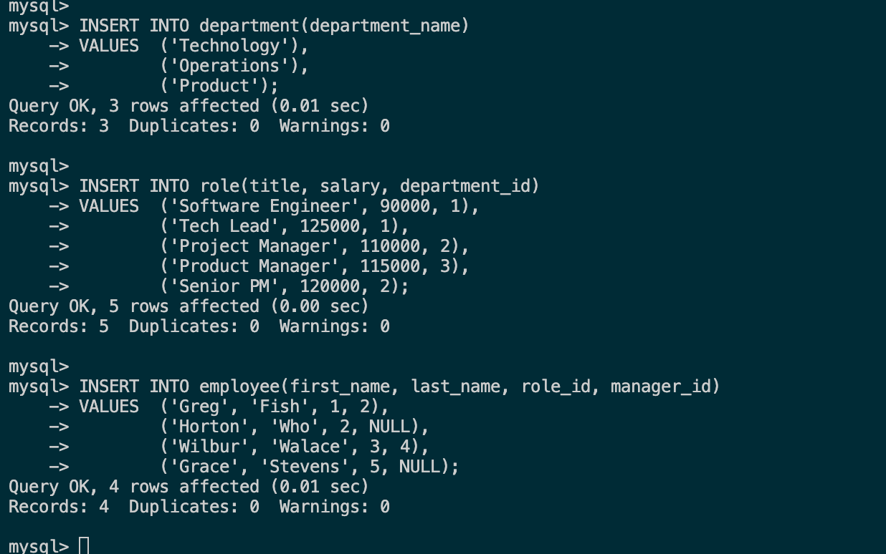
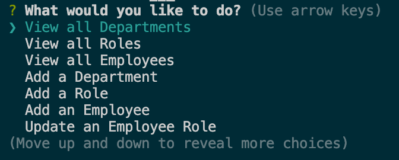
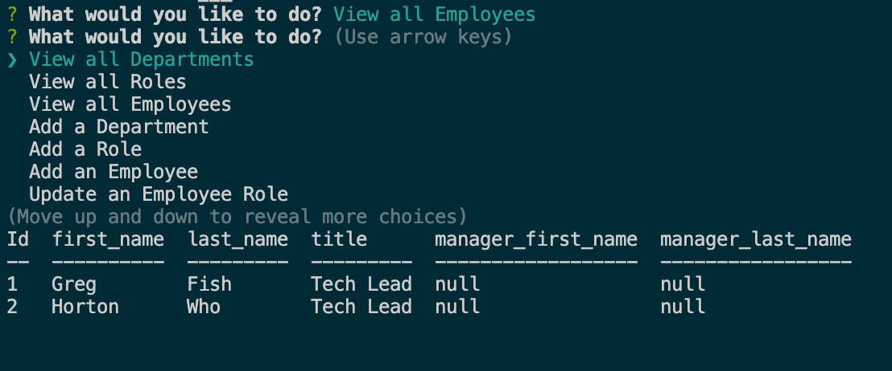

# Employee Tracker CLI
## Description

This application is a command line interface that can be used to mannage departments, roles, and employees. It allows the user to view seperate tables of all three, as well as update and delete from those tables.

View a demonstration video [here](https://drive.google.com/drive/folders/1XYYaehyo6FlSa0qejlM-PPey1XExy64E?usp=sharing)

## Table of Contents

-[Installation](#installation)  
-[Usage](#usage)  
-[Contributing](#contributing)  
-[Questions](#questions)  
-[License](#license)  

## Installation

The following is required to install the program.  
npm i

## Usage
To run, do the following:   
After running npm I, type node server.js into the command line to activate the application. The user also has to run the schema.sql files to create the sql database and tables. If looking to test functionality, you can run the seeds.sql file as well to populate the tables with data.

Usage Images:

  
  
  

## Contributing

Please fork.

## Questions

For questions please check [my GitHub](https://github.com/Tward9)
or reach out via email at <theoward9@gmail.com>
